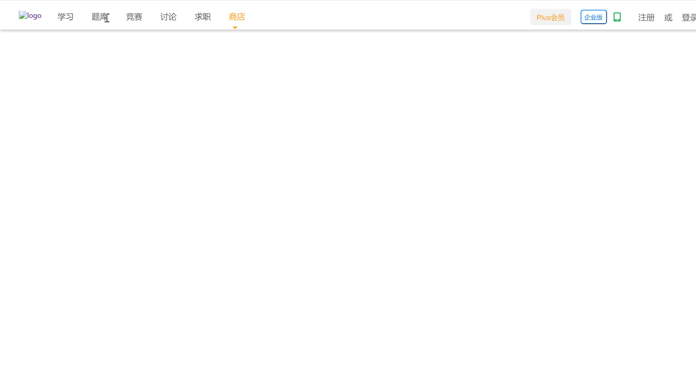
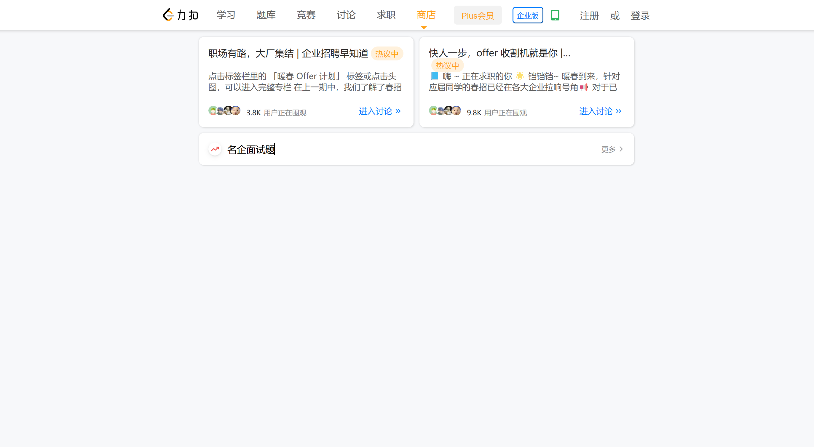
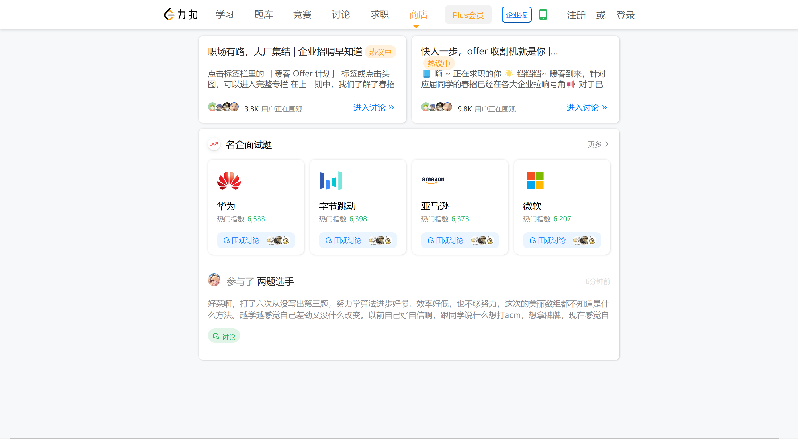
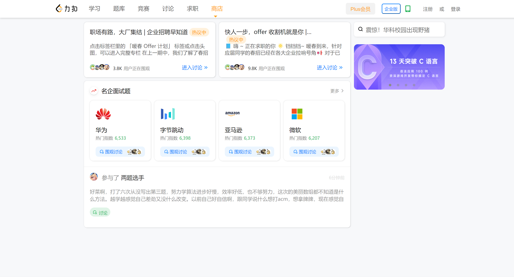
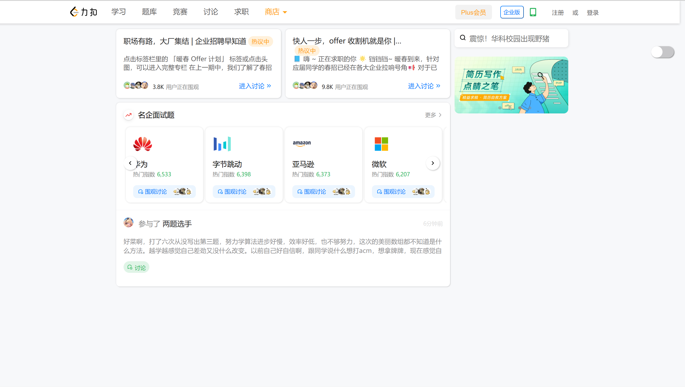

# 冰岩实习
## day1
+ ### Done
  - 把顶部导航栏搞得差不多了
+ ### Trouble
  - 商店那个三角形不知道怎么弄到上面去
  - 边缘留白还不晓得怎么处理
  - 图片不知道为啥显示不出来
  
## day2
+ ### Done
  - 完成了上面的一个板块
  - 处理好了边缘留白以及图片
+ ### Trouble
  - 标题和热议弄不到同一行
  - 推荐的文章是直接copy的，不知道怎么用实际数据

# day3
+ ### Done
  - 面试题部分差不多啦
  - 文章部分也快搞完了
+ ### To do
   - 得快去学学js了哈哈，不然后面高阶的不会了

# day4
+ ### Done
  - 成功做成了返回顶部的按钮

今天满课，没时间做什么呜呜呜呜呜呜呜

# day5
+ ### Done 
   - 成功做成轮播图，好耶~
   - 完善了一些小细节
  
+ ### Trouble
  - 还不会怎样点按钮就让轮播图固定一个位置，明天再来
  

# day6
+ ### Done
   - 各种效果都搞得差不多了哈哈哈开心，弄了一天的成果
+ ### Trouble
  -  然而很多效果都很生硬，不是很丝滑

  
# day7
~~满课快乐，只有中午半个小时的自由时间hhh~~
+ ### Done 
   - 在youtube上学了一下localstorage
   - 处理了一些过渡效果
